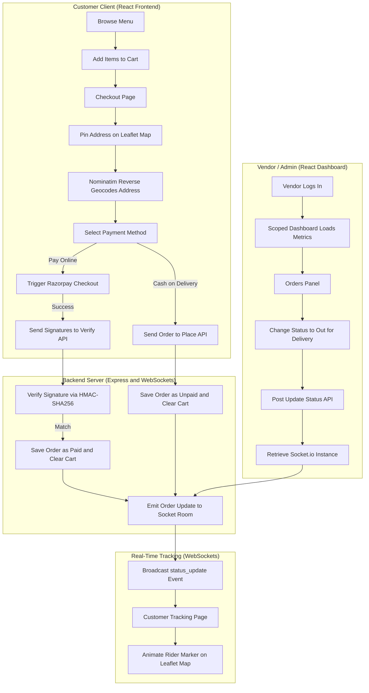

# Grubbly - Fullstack MERN Food Delivery Platform

Grubbly is a modern, responsive, and feature-rich Food Delivery Web Application built using the MERN Stack (MongoDB, Express, React, Node.js). 

The platform implements a multi-role authorization architecture (supporting Customers, Kitchen Vendors, and Platform Admins), real-time order status tracking via WebSockets, interactive Leaflet Maps for address pinning, a Razorpay Payment Gateway in test mode, and a scoped analytics dashboard for kitchen management.

---

## System Flow Diagram

The flowchart below demonstrates the integration between the Customer App, Admin Portal, Backend Server, and external integrations (Razorpay, OpenStreetMap, and WebSockets):



---

## Key Features

### Customer Features
*   **Interactive Menu**: Browse dishes with dynamic images, categorization, pricing, and live stock availability.
*   **Leaflet Map Pinning**: Interactive map in checkout to drop a pin on the delivery location. Autofills address inputs instantly using OpenStreetMap's Nominatim reverse-geocoding API.
*   **Stripe and Razorpay Integration**: Test mode online payments with secure, cryptographic HMAC-SHA256 signature verification.
*   **Live Order Tracking**: Interactive map rendering the delivery route (Restaurant to Home) and animating a motorcycle delivery rider in real-time along the path using WebSockets.

### Partner Portal (Kitchen Vendors and Admins)
*   **Multi-Role Dashboards**: 
    *   **Vendors**: Scoped views showing metrics (revenue, orders placed, stockouts) and transactions belonging only to their kitchen.
    *   **Admins**: Comprehensive overview across all vendors, platform metrics, and overall menu management.
*   **Inventory Control**: Toggle dish availability ("In Stock" / "Out of Stock") from the items list with instant frontend updates.
*   **Delivery Location Viewer**: Interactive map modal inside order lists showing the exact delivery pin chosen by the customer.
*   **Status Updates**: Change order progress stages (Food Processing -> Out For Delivery -> Delivered) which pushes instant updates to the customer's tracking screen.

---

## Technology Stack

*   **Frontend**: React (Vite), Tailwind CSS, Axios, React Router, React Toastify.
*   **Backend**: Node.js, Express.js, Socket.io (WebSockets), Multer (Image uploads).
*   **Database**: MongoDB (Mongoose schemas).
*   **Maps and Geocoding**: Leaflet JS, OpenStreetMap Tiles, Nominatim API.
*   **Payment Gateway**: Razorpay Checkout SDK.

---

## Project Structure

```text
grubbly/
├── backend/             # Express API Server & WebSockets
│   ├── config/          # DB connections
│   ├── controllers/     # Authentication, Foods, and Orders handlers
│   ├── middleware/      # JWT auth & Role-based authorization
│   ├── models/          # MongoDB/Mongoose Schemas
│   ├── routes/          # API endpoint routes
│   └── server.js        # Server entry point wrapping Express in HTTP+Socket.io
├── frontend/            # Customer React App (Vite)
│   ├── src/
│   │   ├── components/  # Layouts, login modals, cards
│   │   ├── context/     # Global StoreContext (URLs, cart states)
│   │   └── pages/       # Home, Cart, PlaceOrder, TrackOrder, MyOrders
├── admin/               # Vendor & Admin Dashboard App (Vite)
│   ├── src/
│   │   ├── components/  # Sidebar, Navbar
│   │   └── pages/       # Login, Dashboard, Add, List, Orders
```

---

## Local Configuration and Installation

### Prerequisite: MongoDB and Razorpay
1. Set up a database cluster on MongoDB Atlas (or run a local instance).
2. Create a free account on the Razorpay Dashboard and copy your Test API Keys (Key ID and Key Secret) from Account and Settings -> API Keys.

### 1. Backend Setup
1. Navigate to the backend directory and install dependencies:
   ```bash
   cd backend
   npm install
   ```
2. Create a `.env` file in the `backend` folder and add:
   ```env
   MONGODB_URI=your_mongodb_connection_string
   JWT_SECRET=your_jwt_signing_secret
   RAZORPAY_KEY_ID=your_razorpay_test_key_id
   RAZORPAY_SECRET_KEY=your_razorpay_test_key_secret
   PORT=3000
   ```
3. Start the backend development server:
   ```bash
   npm run dev
   ```

### 2. Frontends Setup (Customer and Admin)
1. Install dependencies for the Customer Frontend:
   ```bash
   cd ../frontend
   npm install
   ```
2. Make sure the backend URL in `frontend/src/context/StoreContext.jsx` points to your backend:
   ```javascript
   const url = "http://localhost:3000";
   ```
3. Start the Customer development server:
   ```bash
   npm run dev
   ```
4. Install dependencies for the Admin Dashboard:
   ```bash
   cd ../admin
   npm install
   ```
5. Update the backend URL in `admin/src/App.jsx`:
   ```javascript
   const url = "http://localhost:3000";
   ```
6. Start the Admin development server:
   ```bash
   npm run dev
   ```

---

## Production Deployment

### Backend (Render / Heroku)
1. Deploy the `backend` subfolder as a Node Web Service.
2. In your MongoDB Atlas Network Access settings, whitelist Allow Access From Anywhere (`0.0.0.0/0`) since hosting platforms allocate dynamic IPs.
3. Configure your production environment variables (`MONGODB_URI`, `JWT_SECRET`, `RAZORPAY_KEY_ID`, `RAZORPAY_SECRET_KEY`) inside the hosting dashboard.

### Frontends (Vercel / Netlify)
1. Point your frontend deployment project to the `frontend` directory using the Vite preset.
2. Point your admin deployment project to the `admin` directory using the Vite preset.
3. Update the `url` endpoints in `StoreContext.jsx` and `admin/src/App.jsx` to point to your live backend domain (e.g., `https://your-backend.onrender.com`) before building.

---

## License

This project is licensed under the MIT License - see the [LICENSE](LICENSE) file for details.

